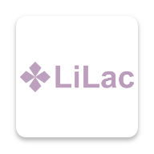
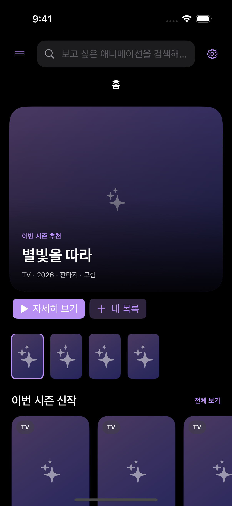
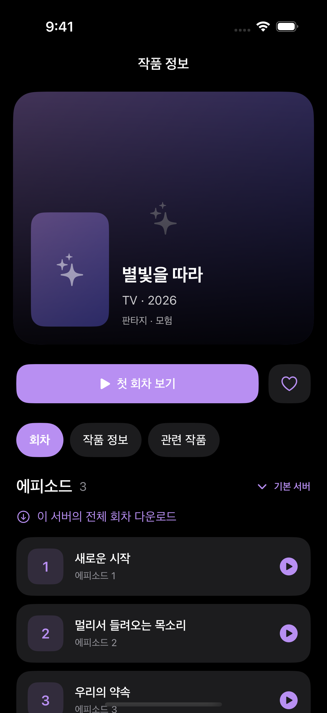
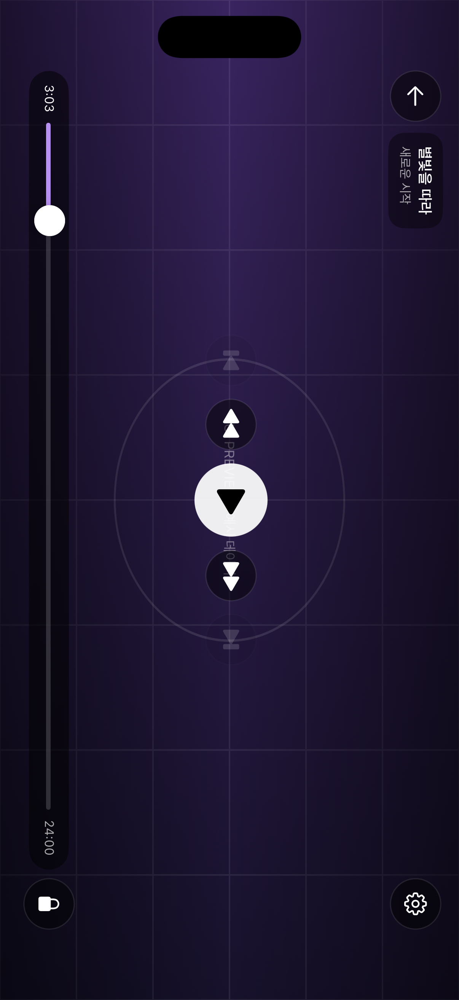
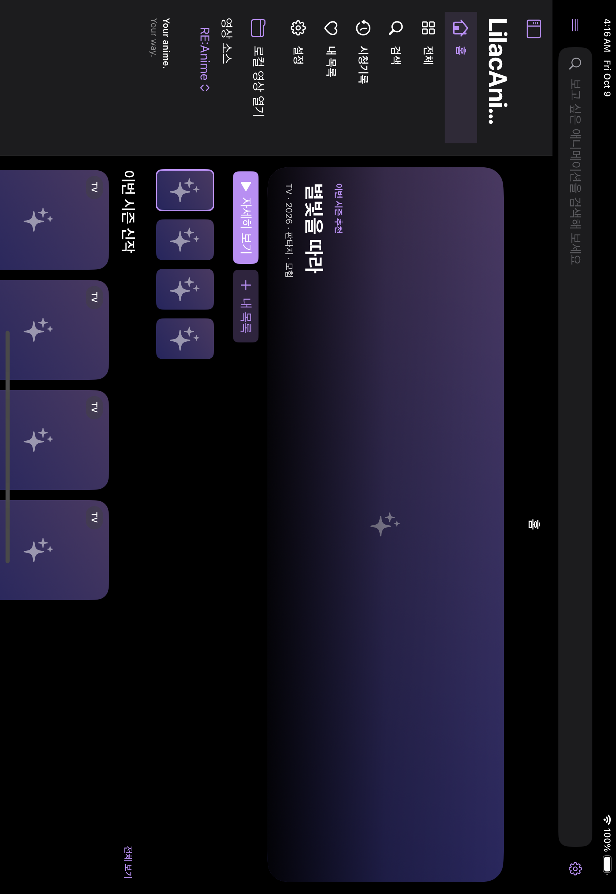

<h1 align="center">LilacAnime iOS</h1>

  
  
  

  
  <a href="https://github.com/whispelyn-byte/LilacAnime-desktop">Windows · macOS 버전</a>

  <a href="https://github.com/dream150/LilacAnime">LilacAnime</a> Android 앱을 Kotlin Multiplatform과 SwiftUI로 옮긴 iOS 포트입니다. 
  작품 탐색부터 회차 재생, 자막 검색·번역, 이어보기와 오프라인 감상까지 제공합니다.

현재 Android 원본과 같은 **0.4.0**을 기준으로 iOS 빌드 **32**을 사용합니다.

## 주요 기능

[데스크탑 0.5.5](https://github.com/whispelyn-byte/LilacAnime-desktop/tree/4cf110427cf46de1f926554fbfdd0968d2821a61)의 콘텐츠·자막·번역·다운로드 기능을 KMP와 SwiftUI로 이식했습니다. 기존 탭 화면·즐겨찾기·시청 기록·자막 싱크·설정·수동 GGUF 가져오기는 보존합니다.

- **탐색:** Linkkf · Ohli24 · Linkani · Animenosub · ReAnime · Miruro, 소스별 검색·필터·방영표·추천, PV·극장판, 전체 카탈로그 수집·재개·한국어 검색.
- **작품 정보:** 한국어·영어·원제 표시, TMDB → AniList → Wikidata 제목·별칭, 한국어 줄거리와 등장인물 표기, 관련 작품·서버·필러/총집편 표시.
- **작업 공간:** 설정에서 데스크탑 작업 공간을 켜면 홈·전체 목록·검색·방영·시청 기록·즐겨찾기·다운로드·로컬 영상·설정을 사이드바로 이용합니다. iPad에서는 목록과 본문을 함께 표시합니다.
- **플레이어:** mpv/ASS, 터치·더블탭 탐색, 화면 잠금·가로 전체 화면, 화질·오디오·자막 트랙, 음량·음소거·화면 맞춤, 이전/다음 화·자동 재생·OP/ED 스킵, 외부 키보드 단축키.
- **한국어 자막:** 제공 한국어 트랙 우선, Kairan · Csora · Anissia 제작자·블로그 검색, Naver·Tistory·Blogger 첨부, Jimaku 파일 목록, 시즌 누적 회차 매칭, ZIP·7z·지원 RAR 자막/폰트 가져오기.
- **AI 번역:** Gemini · OpenAI · DeepL · Qwen, API 연결·모델 목록·제공자별 모델 기억, 재생 장면 우선 번역·부분 결과 즉시 표시·캐시 재개, API/로컬 대체, 등장인물·화자별 호칭·사용자 용어집, 다음 화 미리 번역·다시 번역.
- **로컬 AI:** Gemma 4 · Aya · Hy-MT2 등 데스크탑 모델 프리셋 받기·취소·이어받기·삭제, Hugging Face 토큰, 수동 GGUF·검색 보존. llama.cpp b11490의 실제 모델 Jinja 템플릿과 모델별 샘플링, Metal/CPU 선택·대체와 마지막 실행 정보.
- **오프라인:** 회차/서버 일괄 저장, 백그라운드 다운로드·재개·전체 관리, 원본·번역 자막·폰트 보존, 다운로드 자막 번역·반복 OP/ED 분석, 영상·자막·분석 정보를 폴더로 내보내기/가져오기.
- **저장·연결:** 회차별 원본/번역 자막 목록·재사용·공유, 보호된 캐시 정리, 기존 시청 기록·이어보기, PiP/AirPlay·Chromecast, 새 릴리즈 자동 확인·IPA 받기·SideStore 업데이트.

PC 창 버튼·설치 프로그램·CUDA·외장 폴더 직접 지정은 iOS의 사이드바/화면 회전·SideStore·Metal/CPU·파일 앱 폴더 이전으로 대응합니다. 화면과 운영체제 동작의 차이 및 검증 범위는 [이식 목록](docs/desktop-port.md)을 확인하세요.

## 화면

  
  
  

  

캡처는 시뮬레이터에서 예시 데이터를 사용했습니다. 실제 작품 이미지나 영상 재생 캡처가 아닙니다.

## 설치

iOS 16 이상 기기와 [SideStore](https://docs.sidestore.io/)가 필요합니다.

1. **[최신 IPA 다운로드](https://github.com/whispelyn-byte/LilacAnime-ios/releases/latest/download/LilacAnime-SideStore.ipa)**를 누릅니다.
2. SideStore의 **My Apps → +**에서 다운로드한 IPA를 선택합니다.
3. SideStore가 Apple 계정으로 서명하고 설치합니다.

릴리스의 IPA는 **압축을 풀지 않습니다.** Actions 아티팩트 ZIP으로 받았다면 바깥 ZIP만 한 번 풀면 됩니다. 앱을 업데이트할 때 기존 앱을 삭제하지 않고 새 IPA를 가져옵니다.

## SideStore에서 업데이트

SideStore의 **Sources → +**에 아래 주소를 추가합니다.

~~~text
https://github.com/whispelyn-byte/LilacAnime-ios/releases/latest/download/source.json
~~~

소스에서 **LilacAnime iOS**를 설치하면 이후 새 버전을 SideStore에서 확인하고 업데이트할 수 있습니다. 이미 IPA로 설치했다면 소스를 추가하고 앱을 확인하세요. 소스와 기존 앱 연결이 되지 않으면 기존 앱을 삭제하지 말고 소스에서 설치를 진행합니다.

**인증 갱신(Refresh)**과 **새 버전 업데이트**는 별개입니다. 소스 등록은 완전한 무인 자동 설치를 보장하지 않으며, SideStore에서 업데이트 버튼을 눌러 설치합니다. 기기에서의 소스 등록·업데이트 동작은 아직 확인하지 않았습니다. [SideStore 공식 FAQ](https://docs.sidestore.io/docs/faq)

## 처음 실행할 때

1. 홈 상단 또는 탐색 탭에서 영상 소스를 선택합니다.
2. 작품을 선택하고 첫 회차 또는 이어보기를 누릅니다.
3. 재생 화면의 자막 메뉴에서 검색하거나 파일을 가져옵니다.
4. **설정 → 한국어 제목 검색 · TMDB**에 API Key 또는 Read Access Token을 넣으면 한국어 자막 검색 제목을 찾는 데 사용합니다.
5. 자막 번역을 사용하려면 설정에서 번역 제공자·키 또는 지원 GGUF 모델을 준비합니다.
6. **설정 → 데스크탑 작업 공간**을 켜면 사이드바로 전체 기능을 이용합니다. 기존 탭 화면은 이 설정을 끄면 돌아옵니다.

한국어 전체 카탈로그는 소스 목록을 모은 뒤 제목 인덱스를 채웁니다. 저장된 목록에서 재개할 수 있고, iOS가 앱을 중단하면 앱을 다시 열어 작업을 이어갑니다. 자막 자동 번역은 설정에서 켜며, 다음 화와 다운로드 번역도 개별 설정할 수 있습니다.

## 자막·모델·다운로드

- 재생 화면의 자막 메뉴에서 제작자/파일을 선택하고, 회차에 저장한 원본·번역 자막을 다시 불러오거나 공유합니다. **다시 번역**은 부분 번역 캐시를 새로 만들고 선택한 제공자로 다시 처리합니다.
- **설정 → 로컬 GGUF 모델**에서 프리셋을 받거나 파일을 가져옵니다. 접근 제한이 있는 Hugging Face 저장소는 해당 모델의 이용 조건 동의와 사용자 토큰이 필요합니다. 대형 모델은 기기 메모리에 따라 로드하지 못할 수 있습니다.
- **다운로드 → 다운로드 폴더 내보내기·가져오기**에서 완료한 회차를 파일 앱의 폴더로 옮깁니다. 폴더에는 영상, 자막, 폰트, OP/ED 정보와 index.json이 포함됩니다. 기존 앱 내부 파일은 내보낼 때 유지합니다.
- **설정 → 저장 자막·캐시 관리**에서 저장한 자막을 보존하고 임시/번역 캐시를 정리하거나 전체 자막을 명시적으로 삭제합니다.
- **설정 → 업데이트·릴리즈 노트**에서 새 IPA를 받고 공유할 수 있습니다. 설치와 서명은 SideStore에서 진행합니다.

## 플레이어 사용

| 조작 | 동작 |
|---|---|
| 영상 한 번 탭 | 조작 버튼 표시·숨김 |
| 영상 왼쪽/오른쪽 더블탭 | 설정한 시간만큼 뒤로/앞으로 이동 |
| 중앙 더블탭 또는 재생 버튼 | 재생·일시정지 |
| 이전/다음 회차 버튼 | 이 재생 세션에서 시청한 이전 회차·다음 회차 이동 |
| 잠금 버튼 | 터치 조작 잠금, 잠금 해제 버튼으로 복귀 |
| 톱니바퀴 | 자막·재생 트랙·속도 선택 |
| 전체 화면 버튼 | 가로 전체 화면 전환 |
| 더보기 메뉴 | 다운로드·Cast·시스템 재생/PiP·웹 플레이어 |
| 외부 키보드 Space / ← / → | 재생·일시정지 / 뒤로·앞으로 탐색 |
| F / M / C | 전체 화면 / 음소거 / 자막 표시 |
| Z / X / S | 회차 자막 싱크 -0.5/+0.5초 / 현재 OP·ED 스킵 |
| 0–9 / [ / ] | 회차의 0–90% 이동 / 배속 감소·증가 |
| PageUp / PageDown / Esc | 이전·다음 회차 / 전체 화면 또는 재생 화면에서 나가기 |

시스템 AVPlayer 및 웹 플레이어는 자체 조작 UI를 사용합니다. PiP/AirPlay 경로는 mpv의 외부 ASS·번역 자막을 그대로 표시하지 않습니다. Cast 자막은 VTT로 변환되어 ASS 스타일 효과가 유지되지 않습니다. iPhone LAN 중계가 필요한 Cast는 앱을 재생 화면의 전경에 유지합니다.

## 문제 해결

- **작품이나 영상이 열리지 않음:** 외부 서비스 장애·로그인·캡차·주소 만료일 수 있습니다. 다시 시도하거나 다른 소스를 선택하세요.
- **자막을 찾지 못함:** 검색 제목을 수정하거나 TMDB 키를 설정하고, 자막 파일을 직접 가져옵니다.
- **번역이 실패함:** 제공자·API 키·사용량 및 GGUF 모델 호환성을 확인하세요.
- **SideStore 설치 실패:** [공식 문제 해결 안내](https://docs.sidestore.io/docs/troubleshooting)를 확인하세요. IPA는 SideStore에서 서명해야 합니다.

## 개발·릴리스

공통 코드 테스트는 JDK 17로 실행합니다.

~~~sh
sh ./gradlew :shared:jvmTest
~~~

iOS 빌드는 Apple Silicon Mac, Xcode, JDK 17, XcodeGen이 필요합니다.

~~~sh
brew install xcodegen
sh iosApp/scripts/verify.sh
~~~

GitHub Actions는 공통 테스트, KMP iOS 테스트, 네이티브 iOS 테스트, 시뮬레이터 캡처, unsigned arm64 IPA 패키징을 실행합니다. **App Store 배포용 서명 빌드가 아닙니다.**

앱 버전은 app/module.toml의 Android versionName을 사용합니다. iOS 빌드 번호는 Android versionCode에 iosApp/revision.txt의 값을 더합니다. 배포 태그는 `python3 iosApp/scripts/android-version.py --tag`로 확인합니다(현재 **v0.4.0-ios.2**). 해당 태그를 푸시하면 모든 테스트·빌드가 성공한 뒤 IPA와 실제 메타데이터로 생성한 SideStore source.json을 릴리스에 게시합니다. 최신 소스 주소는 그대로 유지됩니다.

| 경로 | 내용 |
|---|---|
| shared/ | Kotlin Multiplatform 모델·소스·자막·공통 로직 |
| iosApp/LilacAnime/ | SwiftUI UI·mpv·다운로드·Cast·번역 연결 |
| iosApp/scripts/ | 검증·IPA 패키징·소스 생성 |
| .github/workflows/kmp.yml | 테스트·빌드·태그 릴리스 |
| [docs/desktop-port.md](docs/desktop-port.md) | 데스크탑 이식 범위·차이 |
| [KMP_IOS.md](KMP_IOS.md) | 이식 상세·검증 결과·남은 제한 |

## 크레딧

- 원본 Android: [dream150/LilacAnime](https://github.com/dream150/LilacAnime)
- 데스크톱 포트 및 README 구성 참고: [whispelyn-byte/LilacAnime-desktop](https://github.com/whispelyn-byte/LilacAnime-desktop)
- 재생: [mpv](https://github.com/mpv-player/mpv) · [MPVKit](https://github.com/mpvkit/MPVKit)
- 자막: Kairan · Csora · Anissia · [Jimaku](https://jimaku.cc)
- 로컬 AI: [llama.cpp](https://github.com/ggml-org/llama.cpp) · [nlohmann/json](https://github.com/nlohmann/json)
- 압축 자막: [libarchive](https://github.com/libarchive/libarchive) ([iOS 의존성·라이선스](iosApp/Native/README.md))
- OP/ED 타임스탬프: [AniSkip](https://aniskip.com)
- This product uses the TMDB API but is not endorsed or certified by TMDB.

원본과 각 의존성의 라이선스 조건을 따릅니다.
